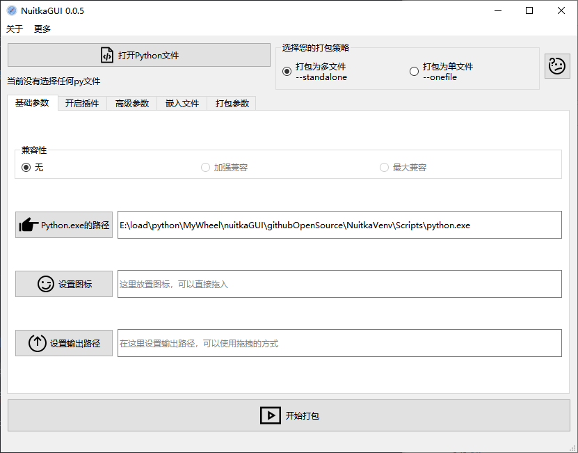
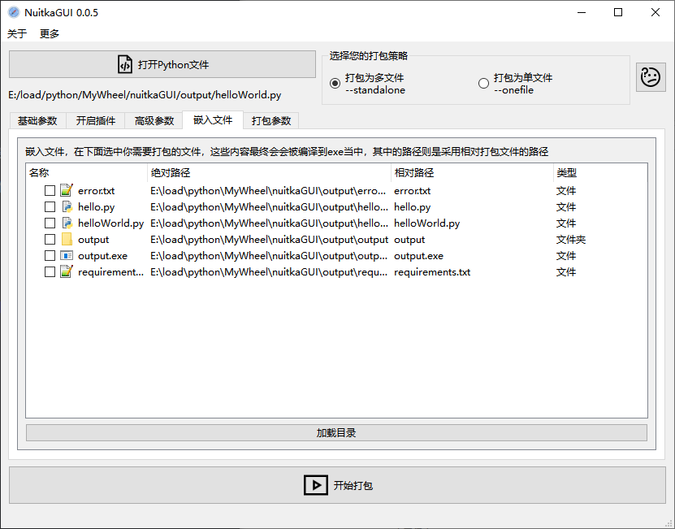
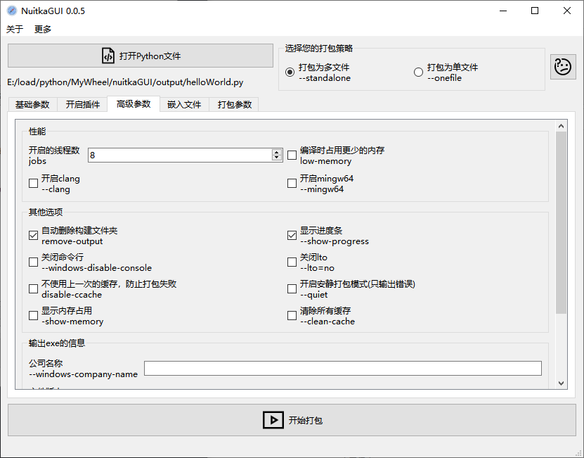
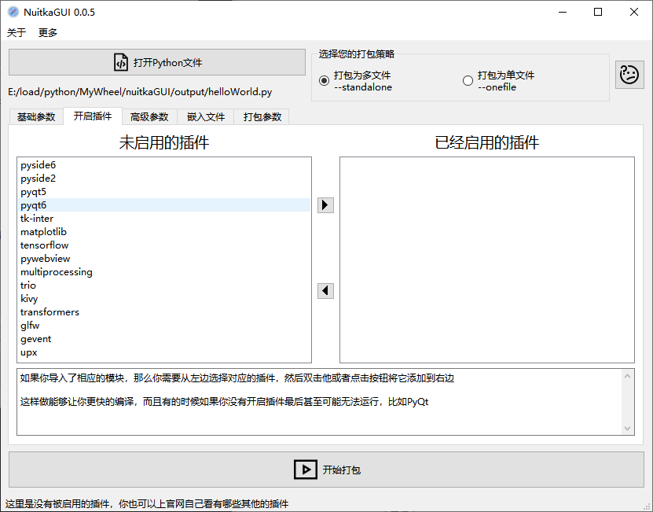

# NuitkaGUI

该项目主要是个人学习和方便个人使用为出发点，请勿进行商业贩售

本项目基于 PySIde6 进行开发，旨在使用最简单的方法能让 nuitka 也能方便打包




## 使用说明

### 编译使用

1. 你需要在本地安装 Python(版本最好在3.9或者以上)
2. 在命令行输入`pip install nuitka`，然后nuitka会自动安装剩下的东西
3. 自行配置环境打开或者用realease里面的可执行文件打开文件
4. 选择你需要打包的文件然后勾选参数，结束

### 直接使用

下载 release 里面的可执行文件，然后直接使用(需要有本地Python环境)

### 更多图片







## 如何编译或者进行修改？

### 项目层面

1. 在项目目录文件下 `nuitkaGUI.py` 是主要执行入口文件，可以使用Qt Designer来对 `nuitkaGUI.ui` 进行编译或者修改
2. 如果新增了图标或者资源文件请重新编译`resource.qrc`文件
3. 请将图片都保存在 `images/` 目录下
4. 如果想查看 nuitka 还有哪些功能可以在命令输入 `nuitka --help` 或者打开项目目录下的 `nuitkaHelp.txt` 查看

### 代码层面

代码主要分为几大板块，首先是初始区域，这里定义了界面上可以使用的参数，后期通过将这个字典里面的值从False改为True，最后通过 for 循环就能达到获取用户勾选了哪些选项，避免了大量的 if-elif-else 语句

```
self.argsDict = {
    '--onefile': False,
    '--standalone': True,
    '--show-progress': False,
    '--show-memory': False,
    '--remove-output': False,
    '--nofollow-imports': False,
    '--follow-imports': False,
    '--windows-disable-console': False,
    '--quiet': False,
    '--disable-ccache': False,
    '--jobs': 8,
    '--output-dir': '',
    '--include-data-files': '',
    '--include-data-dir': '',
    '--windows-icon-from-ico': '',
    '--windows-company-name': '',
    '--windows-file-version': '',
    '--windows-product-version': '',
    '--windows-file-description': '',
}

# 将插件添加到字典中
pluginList = ['pyside6', 'pyside2', 'pyqt5', 'pyqt6', 'tk-inter', 'matplotlib',
              'tensorflow', 'pywebview', 'upx', 'multiprocessing', 'trio', 'kivy']
for each in pluginList:
    self.argsDict[f'--plugin-enable={each}'] = False
```

使用 `self.getArgs()` 函数获取当前的值，然后使用 `self.startNuitka()` 函数作为启动程序的入口，通过PySIde6的QProcess来调用系统命令行

如果你想要新增更多功能可以在相应的页面添加槽函数，然后在 `self.bind()` 函数里面进行信号与槽的绑定