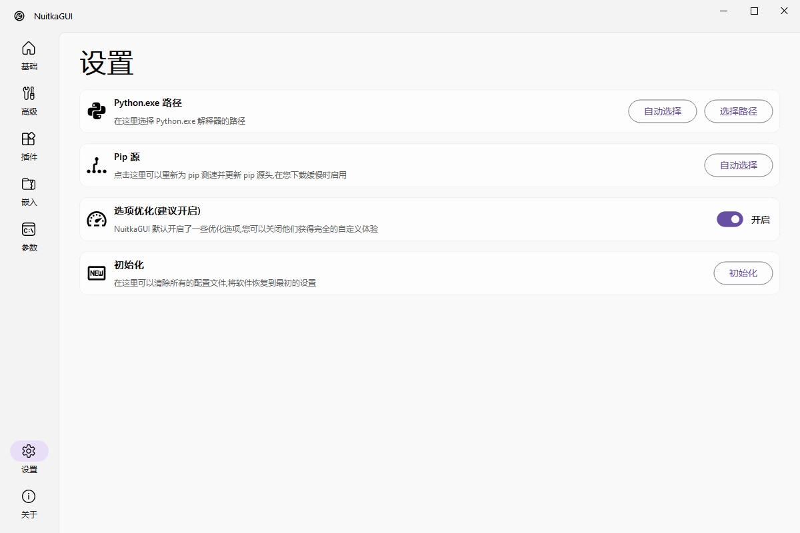

# NuitkaGUI

NuitkaGUI 是一个可视化的打包工具，封装了 nuitka 的一些主要功能，该工具面向 window 系统，暂时没有做 Linux 和 Mac 兼容的准备，而且不支持多语言，该项目为本人 MVP 框架结构的一次尝试，可以前往 B站 查看我对该项目的经验总结和 MVP 框架的总结(不过目前视频还没做出来)

<br />

<p align="center">
  <a href="README.assets/software_icon.svg">
    
  </a>

  <h3 align="center">NuitkaGUI</h3>
  <p align="center">
    一个可视化的 Nuitka 打包工具
    <br />
    <a href="https://space.bilibili.com/282527875"><strong>前往作者B站 »</strong></a>
    <br />
    <br />
  </p>

</p>


## 目录

<!-- @import "[TOC]" {cmd="toc" depthFrom=1 depthTo=6 orderedList=false} -->

<!-- code_chunk_output -->

- [NuitkaGUI](#nuitkagui)
  - [目录](#目录)
  - [软件功能](#软件功能)
  - [上手指南](#上手指南)
    - [推荐运行方法](#推荐运行方法)
    - [编译运行](#编译运行)
  - [图片展示](#图片展示)
  - [鸣谢](#鸣谢)

<!-- /code_chunk_output -->

## 软件功能

- **漂亮的内嵌文件页面**，告别 `include-data-dir` 和 `include-data-files` 命令，通过点点点就能将文件在打包的时候嵌入
- **默认开启常用参数**，减少新手报错的同时节省老手的时间(*如果有更多有用的参数欢迎提交issue*)
- **自动识别插件**，通过遍历文件树的方式自动开启项目目录下能开启的插件，减少重复劳作
- **动态的插件**，每一次插件都是动态从命令行中进行获取，以此保证不会出现当前 nuitka 版本不存在的选项
- **完整的说明**，如果不明白选项的用处可以通过鼠标悬停到对应控件上即可看到对应的功能说明
- **自动下载**(测试功能)，通过自动下载 gcc 可以有效减少等待时间，官方将会从外网下载 200 MB 的文件，而该软件则是从镜像源下载了一个 78 MB 的 gcc 最大程度减少等待

## 上手指南

### 推荐运行方法

直接通过 Release 下载最新的版本直接点击其中的 exe 文件即可运行

### 编译运行

> 推荐运行环境 Python 3.10

通过在项目根目录下输入下面的命令安装第三方库

```cmd
pip install -r requirements.txt
```

然后运行项目根目录下的 `main.py` 文件

## 图片展示

> 首次运行的设置页面


> 设置完成


> 主页面


> 文件拖动显示


> 文件拖动显示


> 插件页面


> 嵌入文件页面


> 参数页面


> 设置页面




## 鸣谢

- ZhiyiYo 提供的 QMaterialWidgets 为本软件完成了美化
  https://github.com/zhiyiYo/QMaterialWidgets
- 一位已经退群的群友，提供了高级页面的布局和控件摆放为我节省了劳动力，但是由于不知道他的 QQ 号，加上他已经退群，所以这里无法给出更详细的信息，希望你能看到，你的努力没有白费