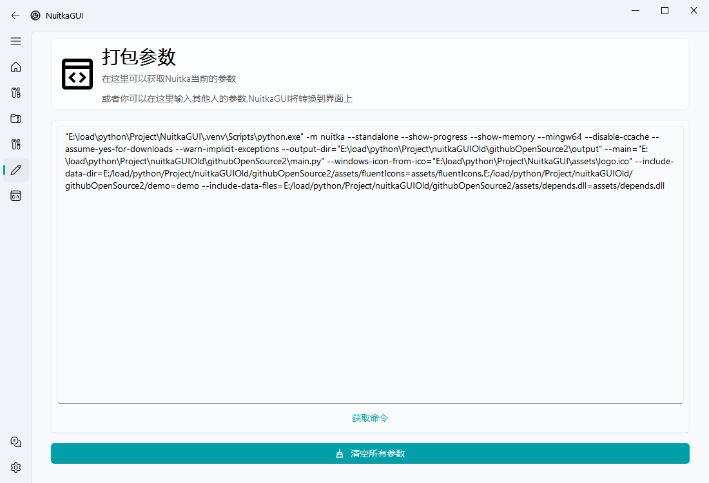

# NuitkaGUI

NuitkaGUI 是一个 Nuitka 的可视化的打包工具，封装了 nuitka 的一些主要功能，软件目标是拖入 py 文件点击打包就能完成所有的操作，内置了很多预制命令，同时对一些难以输入的命令进行可视化


<p align="center">
  <a href="README.assets/software_icon.svg">
    
  </a>

  <h3 align="center">NuitkaGUI</h3>
  <p align="center">
    一个可视化的 Nuitka 打包工具
    <br />
    <a href="https://space.bilibili.com/282527875"><strong>前往作者B站 »</strong></a>
    <br />
    <br />
  </p>


## 软件功能

- **漂亮的内嵌文件页面**，告别 `include-data-dir` 和 `include-data-files` 命令，通过点点点就能将文件在打包的时候嵌入
- **默认开启常用参数**，减少新手报错的同时节省老手的时间(*如果有更多有用的参数欢迎提交issue*)
- **动态的插件**，每一次插件都是动态从命令行中进行获取，以此保证不会出现当前 nuitka 版本不存在的选项
- **自动识别插件**，使用 AST 语法树识别导入模块，自动识别并且开启插件，大幅减少劳动
- **完整的说明**，如果不明白选项的用处可以通过鼠标悬停到对应控件上即可看到对应的功能说明
- **环境自动配置**，自动将 gcc 等一堆烦人依赖自动安装，让打包开袋即食，同时不会占据 C 盘空间

## 上手指南

### 推荐运行方法

直接通过 Release 下载最新的版本直接点击其中的 exe 文件即可运行

### 编译运行

> 推荐运行环境 Python 3.10

通过在项目根目录下输入下面的命令安装第三方库

```cmd
pip install -r requirements.txt
```

然后运行项目根目录下的 `NuitkaGUI.py` 文件

## 图片展示

> 首次运行的设置页面


> 设置完成


> 主页面


> 文件拖动显示


> 更多设置页面


> 插件页面


> 嵌入文件页面


> 参数页面



> 输出页面


> 设置页面


## 鸣谢

- ZhiyiYo 提供的 QMaterialWidgets 为本软件完成了美化
  https://github.com/zhiyiYo/QMaterialWidgets
